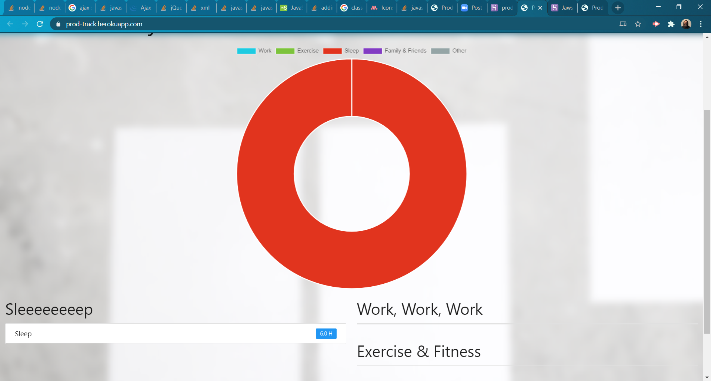

# productivityTracker

## Description
Simple Application Using ExpressHandlebars and JawsDV  To Track How Productive You Are Throughout The Day

Link to live site: [productivityTracker](https://kileelucero.github.io/productivityTracker/)

## Table of Contents

* [Installation](#installation)
* [Usage](#usage)
* [Contribution](#contribution)
* [Tests](#tests)
* [License](#license)
* [Questions](#questions)

## Installation
Deployed with Heroku: https://prod-track.herokuapp.com/
## Usage
Great Way To Visually See Where Your Time Is Being Spent Throughout The Day/Week
## License
MIT
Copyright (c) 2020 Kilee Lucero
## Contribution
When contributing to this repository, please first discuss the change you wish to make via issue, email, or any other method with the owner(s) of this repository before making a change.
## Tests
None
## Questions
For any questions the author can be contacted at:
GitHub: @[kileelucero](https://github.com/kileelucero)
Email: kileelucero@gmail.com
